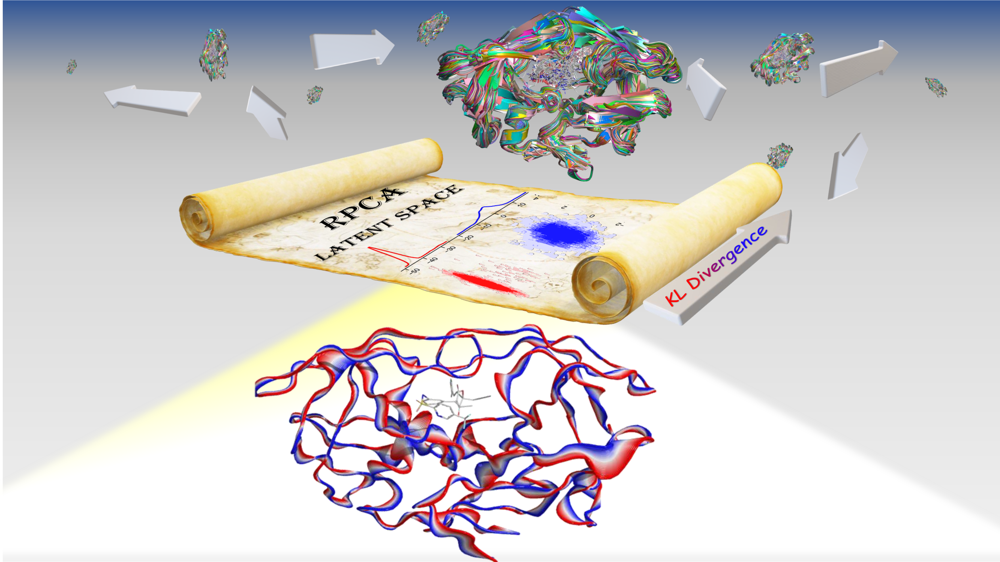
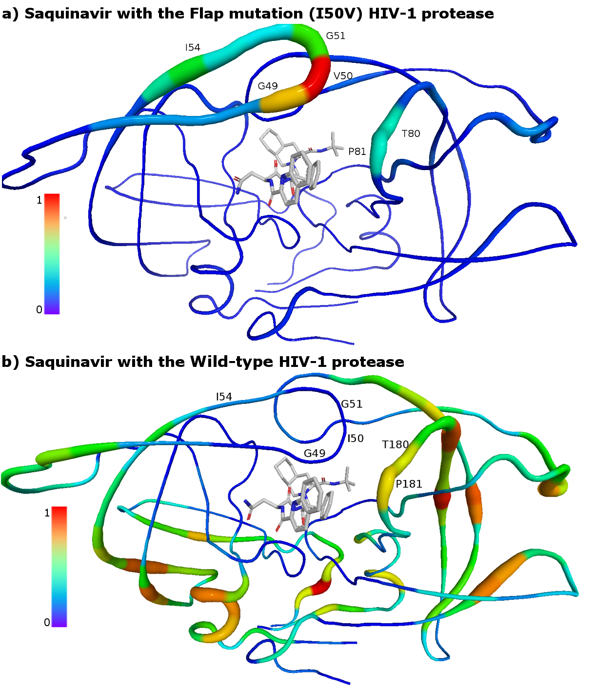
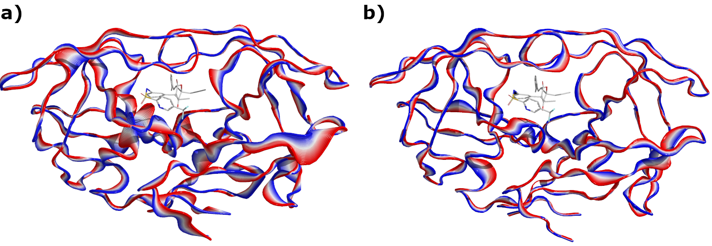
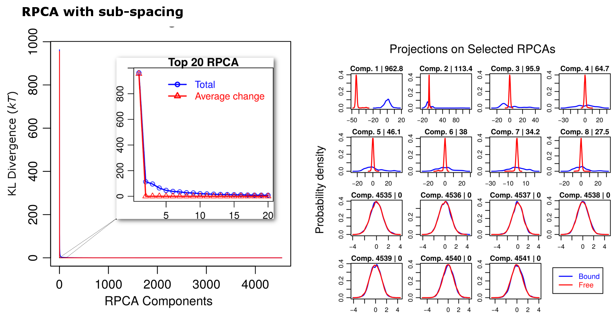

# Relative Principle Components Analysis (RPCA)

This is the source code of the computational tools to perform RPCA of the conformational changes upon biomolecular interactions

## References
*  Ahmad, M., Helms, V., Kalinina, O. V. & Lengauer, T. Relative Principal Components Analysis: Application to Analyzing Biomolecular Conformational Changes. J. Chem. Theory Comput. 15, 2166–2178 (2019).
* Ahmad, M., Helms, V., Kalinina, O. V. & Lengauer, T. Elucidating the energetic contributions to the binding free energy. J. Chem. Phys. 146, 014105 (2017).
* Ahmad, M., Helms, V., Kalinina, O. V. & Lengauer, T. The Role of Conformational Changes in Molecular Recognition. J. Phys. Chem. B 120, 2138–2144 (2016).
* Ahmad, M., Helms, V., Lengauer, T. & Kalinina, O. V. How Molecular Conformational Changes Affect Changes in Free Energy. J. Chem. Theory Comput. 11, 2945–2957 (2015).
* Ahmad, M., Helms, V., Lengauer, T. & Kalinina, O. V. Enthalpy–Entropy Compensation upon Molecular Conformational Changes. J. Chem. Theory Comput. 11, 1410–1418 (2015).


## RPCA analysis provides to following possibilities to check the impact of the conformations changes
### Conformational hotspots analysis

Conformational hotspots analysis recognizes the importance of the resistance-related mutation (I50V) of HIV-1 protease when bound to Saquinavir. The conformational hotspots of the mutant (a) are located at the flap region around the mutation V50. The corresponding flap residues of the wild-type (I50) in figure (b) do not show energetically important (expensive) conformational changes. The radius and the color of the cartoon indicate the importance of the conformational changes. The importance is normalized relative to the highest value. The structures of the ligands are taken from the experimental structure of the complexes (PDB codes 3OXC and 3CYX for the wild-type and the I50V mutant respectively). 

### Representation of the enhanced and restricted conformational fluctuations

Representation of the enhanced and restricted conformational fluctuations of HIV-1 protease upon binding the inhibitor Tipranavir. Conformations around the average conformation are reconstructed from the latent variable after interpolation around its average along selected generalized eigenvectors a) Enhanced conformational fluctuations around the average structure of the bound state along the 33 eigenvectors with the highest generalized eigenvalues (λ<sub>i</sub>>10). These conformational fluctuations increase the affinity of binding by optimizing the local conformations in the ligand-receptor interface. b) Conformational fluctuations around the average structure of the free state along the 33 eigenvectors with the smallest generalized eigenvalues. These latter fluctuations are highly restricted upon the association (λ<sub>i</sub>< 0.009) because they decrease the affinity of binding via adverse local movements in the binding pocket and opening of the flap regions

### RPCA component analysis of the conformational changes


RPCA of HIV-1 protease upon its association with Tipranavir. Shown are the optimal RPCA with sub-spacing. The right panels show the KL divergences of the components (blue colored) and their corresponding contributions due to the change of the average (red colored). Left panels show projections of the data points (conformations) of both the initial (free, unbound) and the final bound state on selected components. The scores (KL divergences) of the components are displayed after their corresponding number. The projections show that the components (components 1-8) with the highest rank (KL divergence) distinguish the change between the free and bound states while the components with the lowest rank do not distinguish the change (similar projections). The analysis is performed using the heavy atoms of the protein.

## The provided tools perform RPCA analysis of two molecular states using the following steps: 
*	GPA fitting of the conformations sampled in the simulation of the first state. The covariance matrix of this state is also computed at this step. A successful superimposition of the ensemble will lead to a singular covariance matrix with at least six eigenvalues of zero value accounting for removing the external degrees of freedom. 
*	 GPA fitting of the conformations sampled in the simulation of the second state to obtain the average conformation.
*	Covariance weighted fitting of the average conformation of the second state on the average conformation of the first state via minimizing their Mahalanobis distance. This unconstrained nonlinear optimization is numerically performed using the line-search algorithm and the BFGS factored method to update the Hessian. 
*	The new average conformation of the second state is used as a reference to refit the conformations of the second state and to compute the covariance matrix of the second state.
*	Simultaneous diagonalization of the covariance matrices is performed. Optionally, the sub-spacing optimal algorithm can be used. 
*	KL divergences of the relative principal components are computed and the components are reordered based on their scores (KL divergences). 
 
## Installing 
### Prerequisites:
**GROMACS-4.6.5**: The tools use few functions from Gromacs-4.6.5 and have to be linked to its library. See the [installation guide of Gromacs-4.6](https://www.gromacs.org/Documentation_of_outdated_versions/Installation_Instructions_4.6).
To install GROMACS-4.6.5 in the folder /usr/local:
```
cd /usr/local && mkdir gromacs && wget ftp://ftp.gromacs.org/pub/gromacs/gromacs-4.6.5.tar.gz \
    && tar xfz gromacs-4.6.5.tar.gz && rm gromacs-4.6.5.tar.gz  && cd gromacs-4.6.5 && mkdir build  && cd build \
    && cmake .. -DGMX_BUILD_OWN_FFTW=ON -DCMAKE_INSTALL_PREFIX=/usr/local/gromacs \
    && make && make install
```

**LAPACK and BLAS** 

Please make sure to modify the Makefile to include the path to the header files of Gromacs and the header file of cblas. Insure having BLAS and and LAPACK libraris.
A simple way to install BLAS and LAPACK libraries on Ubuntu:
```
sudo apt-get update -y && sudo apt-get install libatlas-base-dev 
```
The tools g_RPCA  g_GPA g_sdiag g_rpcana will be compiled using the command
```
make all
```

### License
This code is distributed without a particular license in the hope that it will be useful. You can freely use it for your scientific research BUT WITHOUT ANY WARRANTY; without even the implied warranty of MERCHANTABILITY or FITNESS FOR A PARTICULAR PURPOSE.
 
### Acknowledgments
* The source code of Gromacs was used as a base for a part of the source code.
* The nonlinear minimizer was written and modified after the [source code](https://github.com/SurajGupta/r-source/blob/master/src/appl/uncmin.c) of nlm () function from R, which in-turn is a C translation of the FORTRAN code of the nonlinear minimization algorithm by [Dennis and Schnabel](https://www.amazon.com/Numerical-Unconstrained-Optimization-Nonlinear-Mathematics/dp/0898713641)


